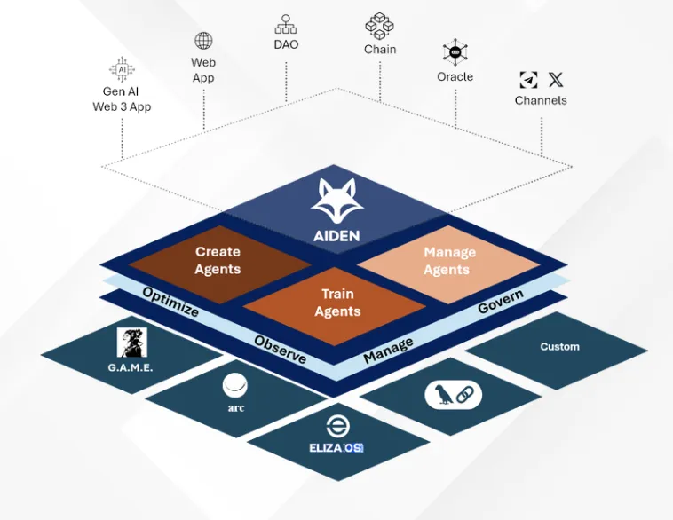

# Aiden - Community Manager for Telegram



This is a hierarchical AI agent system for community management, with AIDEN as the high-level planner that coordinates specialized agents.

## Setting up the Agent

First go to the agent folder:

```sh
cd agent
```

Install dependencies:

```sh
pnpm install
```

Then, configure your environment variables:

```sh
cp .env.example .env
```

Run the development server:

```sh
pnpm run aiden
```

## Setting up the Dashboard Metrics

First, install dependencies in the root directory:

```sh
pnpm install
```

Then, configure your environment variables:

```sh
cp .env.example .env
```

Run the development server:

```sh
pnpm run dev
```

Open [http://localhost:3000](http://localhost:3000) in your browser to see the project.

## Environment Variables Required

Make sure your `.env` file includes:
- `API_KEY` - Your API key
- `OPENAI_API_KEY` - Your OpenAI API key
- `NETWORK_ID` - (Optional) Defaults to "base-sepolia"
- `PRIVATE_KEY` - (Optional) Will be generated if not provided


